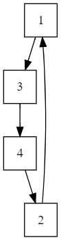
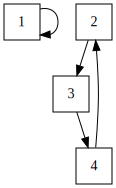

## Minimum Swaps 2

* Read the problem in pdf file under the directory.

* A swapping is swapping 2 elements in the array.

* Find the mininum number of swapping needed to sort the array in ascending order.

* Observe following from the problem:
    * array has element from 1 to n.
    * Unique for all of them.

## Reasoning

* `[7, 1, 3, 2, 4, 5, 6]`
* Each swap should take array closer to the sorted array. For contradiction, assuming multiple swaps are involved,
then it can be simplied to just one swap.
  * `[3, 2, 1]`, 2 is in the right place; 3, 1, are not. Use OOE to describe the elements are out of order.
  * swap(1, 2): `[3, 1, 2]`; OOE: 3
  * swap(0, 1): `[1, 3, 2]`; OOE: 2
  * swap(1, 2): `[1, 2, 3]`; OOE: 0
  * If the swap descreases the number of OOE, then it's efficient, else, we have to make another swap to increase the
  OOE
    * OOE either increase by 2, or incrase by 1.

## The Solution

* The sorting process is a mapping, like a function, mapping from the domain to its image, and we can introduce a graph

to represent this process.

* The array we are looking at: [3, 1, 4, 2]

  * 

  * The element at index 1 of the array is 3, and it should be at index 3, hence, we connet an edge fron 1, to 3.

* Swap(0, 1): [1, 3, 4, 2]

  * 

  * After applying the swap of 3, 1, we recovered one of the element in the circle into the desired position.

* Observe that, inductively for a cirle with a size of n, we will need n - 1 swapping operations to place the element
in the correct order.

* Circle within circles can exists in the array, and in that case, we will need to identify all the circles to count

the number of swaps needed to order the elements in the array.

## The implementations

* Super easy, just read the number from the array, and then jump to the index they should be in, count the number of
jumps, and then terminate when it when it goes back to where it started.

* Record all the nodes in the circle, and dont visit then after they hace been detected.